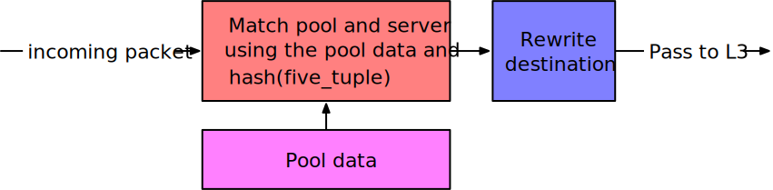

# Abstract

# Introduction

L4 load-balancers enable horizontal scaling of traffic for a service across
multiple application servers.
They do so by mapping a _virtual IP_ (VIP) to a pool of _direct IPs_ (DIPs), or
the actual application servers: when a request arrives to the VIP, the load
balancer forwards it to one of the multiple servers in the DIP pool.
This is critical to performance, especially for large services, because with
load balancing what appears to be a single endpoint can process more requests at
the same time.
However, the load balancer quickly becomes a bottleneck: a high-end software
load balancer can forward up to 12 Mpps, while the underlying network throughput
can easily reach multiple Gpps.\ref{maglev}

Furthermore, load balancers typically select servers from the pool
uniformly, which can pose problems in multiple scenarios.
If the servers are heterogeneous, whether it is because of a different hardware
configuration, or because they run multiple different applications (as is often
the case in data centres), uniformly distributed requests often do not correspond
to uniformly distributed load. It would be very useful to take into account some
server metrics, such as server load or mean request latency, when making load
balancing decisions.

Therefore, this project proposes an SDN-based load balancer able to load-balance
entirely in the data plane (i.e. at line rate), which can additionally forward
the requests to the application servers with an arbitrary, dynamically adjustable
distribution.
The distribution can then be derived at real-time from application server
metrics such as server load or request latency.

# Background and related work

L4 load balancing in general works as follows:

1. Match the packet's destination IP and destination port against the load
   balancer's Virtual IPs and map to a server pool.
2. Select a DIP from the pool. This can be done e.g. in a round-robin fashion,
   or by hashing the fivetuple. The usual approaches result in a uniform
   distribution of requests to servers.
3. Re-write the destination IP and port.
4. Forward the packet to the selected server.
5. Make sure to handle the return path correctly: rewrite the source IP and port
   back to the Virtual IP on replies for this request.

The challenge when implementing an SDN-based load balancer is **per-connection
consistency**, i.e. making sure that all packets of a given connection are
forwarded to the same application server.
Unlike in software, a hardware-based load balancer cannot afford to
keep much state (because that would reduce performance), and therefore it is not
trivial to ensure that all packets of the same connection will be forwarded to
the same server when the pool changes.
Pool changes are quite frequent, as especially in large data centres servers come
offline or online multiple times per second.\ref{whyisthereatypointhispaperstitle}

SDN-based load balancing has been explored in \ref{silkroad}. The paper focused
on performance, scalability, and the ability to handle frequent changes to the
DIP pools.
The approach in this paper is highly optimised and rather clever.
While their way of ensuring per-connection consistency has a better memory
footprint than ours, we found it valuable to create a simpler approach.
We enjoyed seeing how SDN enables solving the same problem in very different
ways, with different tradeoffs.

To our knowledge, SDN-based load balancing with an adjustable distribution has not been explored before.

# Implementation

## Guiding principles

During the implementation, we dedicated non-negligible effort to keeping the
high-level structure clean: the different components are in clearly separated, well
decoupled modules.
This is true not only, but especially for code dealing with different network
layers: the L2 switching, "L2.5" ARP, and L3 routing are completely separate and
each layer can be freely exchanged with another implementation without modifying
the other layers (as it should be).
This is the case not only for the controller code (which uses various
modularity-friendly features of Python such as modules, classes and
inheritance), but also for the P4 code, to the extent possible by the current
"flat" file structure needed by the P4 compiler.\footnote{
Looking back, the author would today write the controller code with much less
inheritance and much more explicit function composition: somewhat in the
spirit of \ref{inheritance}. Nevertheless, even this not entirely optimal
approach was good enough to save a lot of time in the later stages of
development. Anything that keeps things decoupled pays off eventually.
}
Thanks to this, the individual components can be be thought about, implemented,
debugged, and tested separately.
This allowed us to progress quickly when unexpected challenges arose, as
changing existing code was relatively easy due to the clean separation.

## L3 and below: A simple router

A load balancer's function is ultimately to rewrite the destination IP and port
and then send the traffic to that host.
Therefore, up to L3 it performs standard routing: it knows how to reach
different hosts.
For simplicity, for this project we implemented a simplifed router which has its
ARP and MAC tables pre-filled by the controller instead of running the ARP
protocol and L2 learning. The different components of a router are the following:

### L3: routing

The packet's destination IP address is matched in the router's _routing table_,
using a longest-prefix match (LPM).
The packet may either be addressed to a host the router is directly connected to
(on some interface), or it may need to be sent further, through a gateway
(through some interface).

Therefore, the routing table maps a prefix to either of:
* a next hop through a gateway and an interface, or
* a direct connection through an interface.

```
routing_table : Prefix -> NextHop (GatewayIP, Interface) | Direct Interface
```

If there is no match (no route to host), we drop the packet.

Note that the next hop’s IP address is in the router’s memory only: it does not
appear in the packet at any time.

### "L2.5": ARP

We now know the IP address and interface of the next hop.
(Note that this is a host that is connected to us directly – it is sitting on
the same wire.)
We need to translate this into an L2 MAC address in order to pass it to L2.
The mapping is stored in the _ARP table_.

```
arp_table : (IPv4Address, Interface) -> MACAddress
```

Note: Interface conceptually belongs there, but the IP address should in fact be
unique.
Our code leaves out the interface for simplicity.

If there is no match, i.e. when we don’t know the MAC address for the IP, the
control plane would normally send an _ARP request_ (and drop the packet).
In our case, we opted to simplify by pre-filling the ARP table from the (known)
topology instead.

IPv6 uses NDP instead of ARP.
While the protocol is different, the data-plane table is conceptually the same.

### L2: switching

Here we get a packet with some destination MAC address, and we need to decide on
which port we should put it.
We use a MAC table to do it:

```
mac_table : MACAddress -> Port
```

Real switches are a bit more complicated than that: for example, redundant links
mean that a MAC address may be on more than one port.
We do not support that.

The MAC table is normally filled at runtime by observing source MACs on incoming
packets.
In our case, we pre-fill it from the known topology for simplicity.

### The control flow: Putting it together

The router applies the tables described above as follows:

1. Apply routing. Find the next hop (either gateway or direct).
1. Apply ARP translation to the “next hop” host. Fill out the destination MAC address in the packet.
3. Apply the MAC table to find the right port for this destination MAC address. Send it out.

## L4: Simple load balancer

As already hinted, a simple load balancer handles incoming packets as follows:



1. Match the packet's destination IP address and port against the _VIPs table_. If it matches, this is a packet we should load balance. If it does not, we skip the following steps. This table's match action sets not only the pool ID, but also the pool size.
2. Compute a hash of the fivetuple, modulo pool size. The fivetuple identifies a connection, therefore the hash will be the same for all packets of the same connection.
3. Match the pool ID and the hash to the _DIPs table_: select a specific server. If the hash is sufficiently uniform, the server will be selected uniformly at random.
4. Rewrite the packet's destination IP and port to the selected server's IP and port.
5. Pass to L3 for routing to the server. Note that now the packet's destination is that server, so L3 can handle it without awareness of our rewriting.

Care must be taken to also rewrite packets on the return path, so that they appear to come from the load balancer. In our case, we add two more tables to handle this, and we apply these only if the VIPs table did not match.

1. Match the packet's source address and port against the _DIPs inverse table_. This table's match action sets the pool ID.
2. Match the pool ID against the _VIPs inverse table_. This table's match action rewrites the source address and port to the appropriate VIP.

## Changing the distribution

## Per-connection consistency

# Evaluation

TODO methods + results

# Conclusion

TODO

# References

TODO bibtexify

maglev: D. E. Eisenbud, et al. 2016. Maglev: A Fast and Reliable Software Network Load Balancer. In NSDI.
silkroad: SilkRoad: Making Stateful Layer-4 Load Balancing Fast and Cheap Using Switching ASICs
whyisthereatypointhispaperstitle: R. Govindan, et al. Evolve or Die: High-Availability Design Principles Drawn from Googles Network Infrastructure. In ACM SIGCOMM 2016.
inheritance: https://www.youtube.com/watch?v=3MNVP9-hglc

# Group organisation

TODO is this good?

The original group split after about two weeks. Most of this project was done by Kamila Součková. Others' contributions are:

## Nico Schottelius

Wrote the packet parsers (Ethernet, IPv4, IPv6, TCP).

## Sarah Plocher

Wrote the first version of the L2 switch. None of the code is present now.
